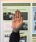

# Official Documentation
## Touch Inverse

> Redefining Touchless Interactions.

## Gestures

Use pre-defined gestures to navigate through the webpage.

Scroll up            |  Scroll down           |    Scroll left        |    Scroll right
:-------------------------:|:-------------------------:|:-------------------------:|:-------------------------:
  |   |  | 

## Installation

### Client-Side Setup

It's as simple as including just two lines of code.

    
    

OR

You can download the latest release of the library from [here](https://cdn.jsdelivr.net/gh/sayamkanwar/TouchInverseJS/dist/touchinverse.min.js) and include it locally in your project.

    
    

### Server-Side Setup 

Follow these steps to start the backend server easily.

1. `git clone https://github.com/sayamkanwar/TouchInverseJS.git` 
2. `cd TouchInverseJS`

TouchInverse's backend has been created on python2.7. It will be migrated to python3 in the next release. 

3. Create a virtual environment: `virtualenv -p /usr/bin/python2.7 venv`
4. `source venv/bin/activate`
5. Install the requirements: `pip install -r requirements.txt`.
6. Install `detectron`: `pip install -e git+https://github.com/facebookresearch/densepose@35e69d110b432704c2183cd6aea531f4f695edbe#egg=Detectron`.

That's all! You're good to go.

To run the server, enter `gunicorn main:app 80`. The backend server will be live at `127.0.0.1:8000`. 

You can now simply include the `touchinverse.min.js` file in your project and it'll add the plugin automatically. 

If you want to test it, a demo has been included in the repository by the name of `demo.html`. You can fire up a python http server to test it: `python -m SimpleHTTPServer 80`. Open `http://localhost/demo.html` in your browser and you can see it in action.  

P.S. If you change the port due to some reason or host the server on a cloud, you'll have to edit the `window.post_url` variable in `touchinverse.min.js` file.  

<footer>
&copy; Touch Inverse Created by <a href="http://sayamkanwar.com/">Sayam Kanwar</a>   
</footer>
